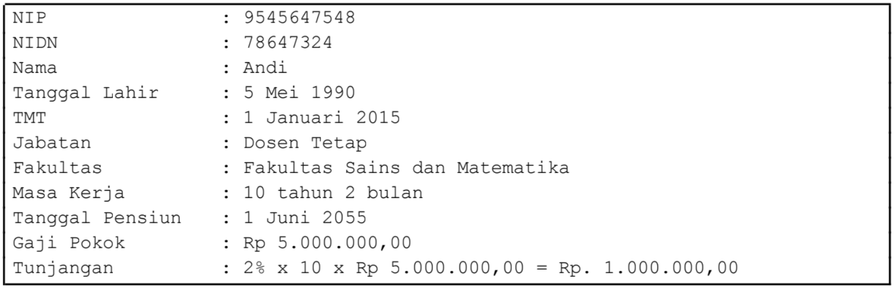

## Latihan

Sebuah perguruan tinggi memiliki pegawai yang terdiri atas dosen dan tenaga kependidikan (tendik). Setiap pegawai memiliki NIP (Nomor Induk Pegawai), nama, tanggal lahir, Terhitung Mulai Tanggal (TMT) bekerja, dan gaji pokok. Dosen terdiri atas 2 jenis, yaitu dosen tetap dan dosen tamu. Dosen tetap memiliki indentitas NIDN (Nomor Induk Dosen Nasional), sedangkah dosen tamu memiliki identitias NIDK (Nomor Induk Dosen Khusus). Dosen tetap memiliki Bata Usia Pensiun (BUP) 65 tahun, dan mendapat tunjangan 2% x masa kerja (dalam tahun). Dosen tamu memiliki tanggal berakhir kontrak dan mendapat tunjangan 2,5% x gaji pokok. Tendik memiliki BUP 55 tahun dan mendapatkan tunjangan 1% x masa kerja (tahun). Masa kerja dihitung dari TMT hingga tanggal saat ini. Tanggal pensiun jatuh pada tanggal 1 bulan berikutnya dari tanggal lahir ditambah usia BUP. Tendik bekerja pada salah satu bidang, yaitu Akdemik, Kemahasiswaan, atau Sumber Daya. Dosen tetap atau dosen tamu bekerja pada fakultas tertentu.

Berdasarkan kondisi tersebut buatlah desain class diagram yang tepat dengan memanfaatkan relasi inheritance, kemudian implementasikan desain anda dalam program Java. Pada setiap jenis pegawai nantinya memiliki method printInfo() yang menampilkan detail data pegawai sesuai dengan jenisnya.

Contoh tampilan informasi detail pegawai untuk Dosen Tetap:

  

Keterangan contoh tersebut:
- Informasi tanggal ditampilkan dalam format <angka hari> <nama bulan> <angka tahun>, contoh: 5 Mei 1990.
- Masa kerja ditampilkan dalam ... tahun ... bulan.
- Masa kerja dihitung dari TMT, yaitu 1 Januari 2015 sampai tanggal saat ini, yaitu 10 Maret 2025.
- Tanggal pensiun dihitung dihitung dari tanggal lahir, yaitu 5 Mei 1990 ditambah BUP Dosen tetap yaitu 65 tahun, dan jatuh pada tanggal 1 bulan berikutnya.
- Pada jenis Dosen Tamu, BUP digantikan dengan masa kontrak berakhir (dalam bulan) dihitung dari tanggal sekarang sampai tanggal berakhir kontrak, sedangkan NIDN digantikan dengan NIDK.
- Pada jenis Tendik, informasi fakultas digantikan dengan bidang tempat bekerja.
